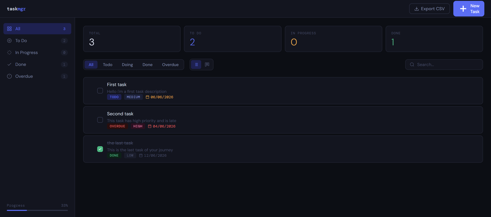

# TaskMgr - Java Task Manager

**Author:** Félix Vandenbroucke · 2026

Task management application built in pure Java, with no framework or external dependency. Two modes: **interactive terminal** and **dark mode web interface** with a REST API. JSON persistence with atomic writes, 217 tests, GitHub Actions CI.



---

## Features

- Create, edit, delete tasks with title, description, due date, status and priority
- **Priorities** LOW / MEDIUM / HIGH with colored pills in the UI
- **Statuses** TODO / DOING / DONE with list view and Kanban board (drag & drop between columns)
- **Colored due dates**: orange if ≤ 3 days away, red if overdue
- **Filters** by status, live search, global progress bar in sidebar
- **CSV export** in one click
- Keyboard shortcuts: `n` new task · `Ctrl+Enter` save · `Escape` close
- Full console mode with interactive menus

---

## Stack

| Layer       | Technology                                       |
|-------------|--------------------------------------------------|
| Backend     | Java 21, `com.sun.net.httpserver` (JDK built-in) |
| Frontend    | HTML / CSS / vanilla JS, zero framework          |
| Persistence | Hand-rolled JSON with atomic writes              |
| Tests       | Hand-rolled framework, zero external dependency  |
| CI          | GitHub Actions                                   |

---

## Project structure

```
taskmanager/
├── src/
│   ├── Main.java              entry point - console and web modes
│   ├── Task.java              data model, JSON serialization, CSV export
│   ├── TaskManager.java       CRUD, persistence, statistics
│   ├── ConsoleUI.java         terminal interface
│   └── ApiServer.java         multi-threaded REST HTTP server
├── tests/
│   ├── TaskManagerTest.java   129 assertions - business logic
│   └── ApiServerTest.java      88 assertions - HTTP integration
├── web/
│   ├── index.html             HTML structure
│   ├── style.css              styles (dark mode, kanban, animations)
│   └── app.js                 frontend logic (API calls, render, drag & drop)
├── .github/workflows/ci.yml   GitHub Actions CI pipeline
├── Dockerfile                 multi-stage container build
├── Makefile                   task automation (build, test, run)
├── tasks.json                 auto-saved data
└── README.md
```

---

## Prerequisites

**Java 17 or higher** (uses switch expressions).

```bash
java -version
javac -version
```

---

## Quick start

```bash
# Build
make build

# Console mode
make run

# Web mode → http://localhost:8080
make web

# Custom port
make web PORT=3000
```

Without Make:

```bash
mkdir -p out
javac -d out src/Task.java src/TaskManager.java src/ConsoleUI.java src/ApiServer.java src/Main.java
java -cp out taskmanager.Main --web
```

### Docker

```bash
docker build -t taskmanager .
docker run -p 8080:8080 taskmanager
```

### JAR

```bash
make jar
java -jar TaskManager.jar --web
```

---

## REST API

| Method   | Endpoint                     | Description                              |
|----------|------------------------------|------------------------------------------|
| `GET`    | `/api/tasks`                 | List all tasks                           |
| `GET`    | `/api/tasks?status=TODO`     | Filter by status (TODO/DOING/DONE)       |
| `POST`   | `/api/tasks`                 | Create a task                            |
| `PUT`    | `/api/tasks/{id}`            | Update a task (partial fields supported) |
| `DELETE` | `/api/tasks/{id}`            | Delete a task                            |
| `GET`    | `/api/stats`                 | Stats by status                          |
| `GET`    | `/api/export`                | Export all tasks as CSV                  |
| `GET`    | `/`                          | Serves the frontend                      |

JSON body for POST / PUT:

```json
{
  "title": "Task name",
  "description": "Optional details",
  "dueDate": "2026-06-15",
  "status": "TODO",
  "priority": "HIGH"
}
```

---

## Engineering highlights

- **Multi-threaded HTTP server**: `FixedThreadPool` with daemon threads handles REST requests in parallel without blocking the JVM, enabling clean server shutdown and reliable test teardown.
- **Atomic persistence**: write-to-temp strategy - data is written to a `.tmp` file then `ATOMIC_MOVE`d to the final file, preventing any corruption on crash.
- **Lightweight Docker image**: multi-stage build using `eclipse-temurin:21-jdk-alpine` to compile, then `eclipse-temurin:21-jre-alpine` for the final image - only the JRE and the JAR ship.
- **CI with timeouts**: GitHub Actions pipeline with 5-minute timeouts per step and separate unit/integration test jobs.

---

## Tests

**217 assertions, zero external dependency.**

```bash
# Run all
make test

# Unit tests only (Task, TaskManager)
make test-unit

# Integration tests only (HTTP, REST API)
make test-api
```

Without Make:

```bash
javac -cp out -d out tests/TaskManagerTest.java tests/ApiServerTest.java
java -cp out taskmanager.TaskManagerTest
java -cp out taskmanager.ApiServerTest
```

Integration tests spin up a real HTTP server on a random free port and fire real HTTP requests - no mocks. Returns exit code 0 if all pass, 1 otherwise (CI-compatible).

---

## `tasks.json` format

Updated automatically after every add, edit or delete. Atomic write: data goes to a `.tmp` file first, then moves to the final file - no data loss on crash.

```json
[
  {"id":1,"title":"Set up the environment","description":"Install JDK 21","dueDate":"2025-02-28","status":"DONE","priority":"HIGH"},
  {"id":2,"title":"Write unit tests","description":"Cover Task and TaskManager","dueDate":"2025-03-10","status":"DOING","priority":"MEDIUM"},
  {"id":3,"title":"Write documentation","description":"README and Javadoc","dueDate":"2025-03-15","status":"TODO","priority":"LOW"}
]
```

Fields: `id`, `title`, `description`, `dueDate` (ISO format: YYYY-MM-DD), `status`, `priority`.
Files without a `priority` field load with MEDIUM as default (backward compatible).